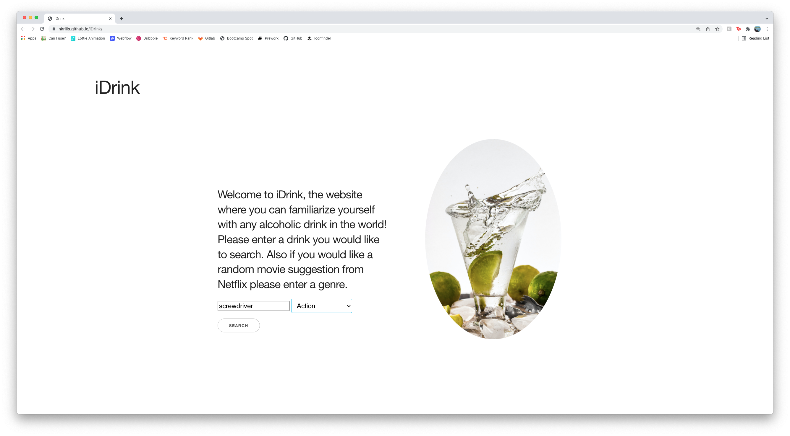
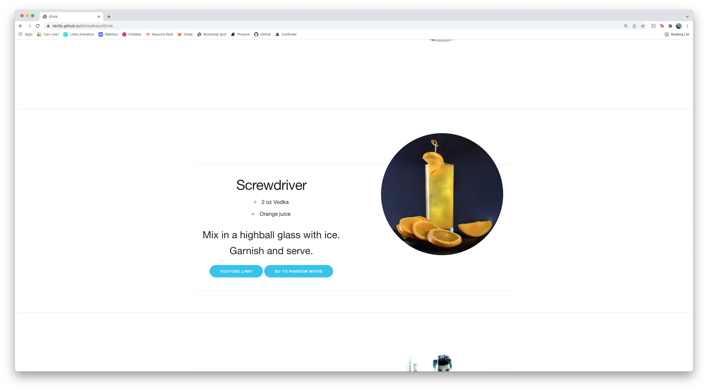
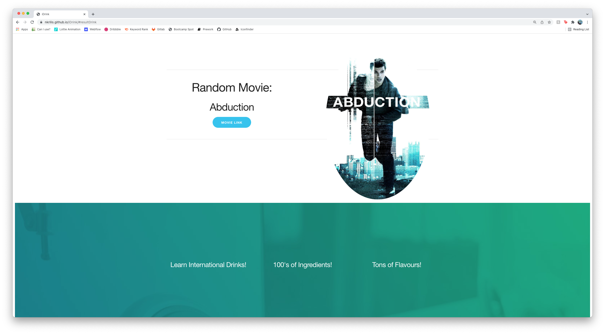

# Project Title : iDrink
## Description :
iDrink is a website where you can familiarize with any alcoholic drink in the world .
In this website you are asked to enter your  favourite drink and   your favourite movie genre. 
Then the website will provide results with the ingredients and instructions for that particular  drink with an image and  Youtube link. 
Besides a movie suggestion according to the  genre you entered will be displayed. 
The APIs we used for this application is from TheCocktailDB and Streaming availability.
* TheCocktailDB API provides the library for the preparation of caocktails.
* Streaming Availabilty API provides the library for list of movies available   on Netflix
 

### Resources
* HTML
* CSS
* Javascript
* Jquery
* Skeleton CSS for framework

### APIs used
* TheCocktailDB: www.thecocktaildb.com/api/json/v1/1/search.php?s=margarita
* Streaming Availability: https://streaming-availability.p.rapidapi.com/search/basic

#### Screenshots

##### Credits
* The CoktailDB API http://www.thecocktaildb.com/api/json/v1/1/search.php?s=margarita
* Sreaming availability API https://streaming-availability.p.rapidapi.com/search/basic
* jQuery https://code.jquery.com/ui/1.12.0/jquery-ui.min.js
* Skeleton CSS Framework https://cdnjs.cloudflare.com/ajax/libs/skeleton/2.0.4/skeleton.min.css
 
 #####
 Here is the URL for the live application: 

